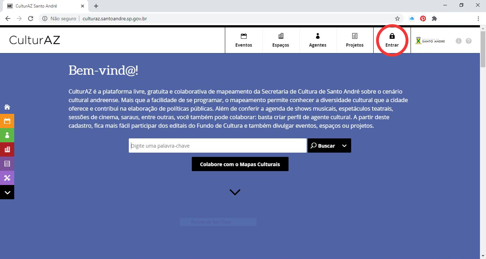

# CRIANDO UM AGENTE INDIVIDUAL

1. Acesse o site [http://culturaz.santoandre.sp.gov.br/](http://culturaz.santoandre.sp.gov.br/) e clique em **‘Entrar’** no menu superior.

1. Comece a criação de seu Agente Individual \(Pessoa Física - ID da Cultura\) no campo **‘Registrar-se’**.



Preste **ATENÇÃO** na hora de colocar e-mail e senha. **ANOTE SEU E-MAIL E SENHA.** A Secretaria de Cultura não consegue recuperar essas informações, somente **VOCÊ**, por meio do processo de redefinição da senha.



1. Na tela seguinte, preencha todos os campos: **‘Nome de exibição’**, **‘Descrição curta’**, **a ficha cadastral completa, INCLUSIVE CPF e E-MAIL PÚBLICO**. Em **‘Selecione um Tipo’**, escolha a opção **‘INDIVIDUAL’**.

1. Abaixo do mapa, insira seu **endereço completo**. O pin do mapa será automaticamente movido para o endereço cadastrado. Caso necessite de ajuste, você pode arrastá-lo manualmente para o endereço exato.
2. Na sequência, você pode inserir no campo **‘Descrição’** uma descrição longa de suas atividades. **Vídeos e Galeria de fotos não são necessários.**

1. No menu da esquerda, selecione uma **‘Área de Atuação’** \(pode ser mais de uma\) e insira **‘Tags’** que ajudem a identificar seu trabalho.



**Lembre-se de ‘Salvar Rascunho’ frequentemente e, ao final, clique em ‘Publicar’.**



**1.**      Seu Agente Individual pode ser editado em qualquer momento desde que você esteja logado na plataforma. Ao editá-lo, lembre-se de **‘Salvar’** e, ao final, clicar em **‘Sair do modo de edição’.**

