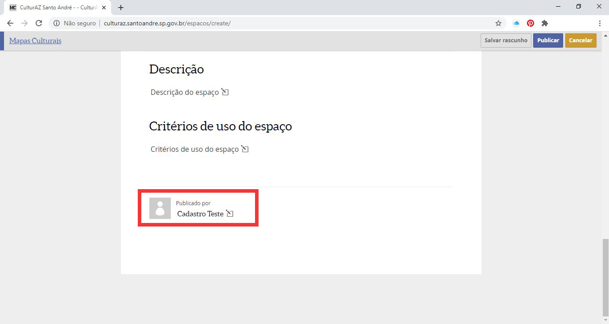
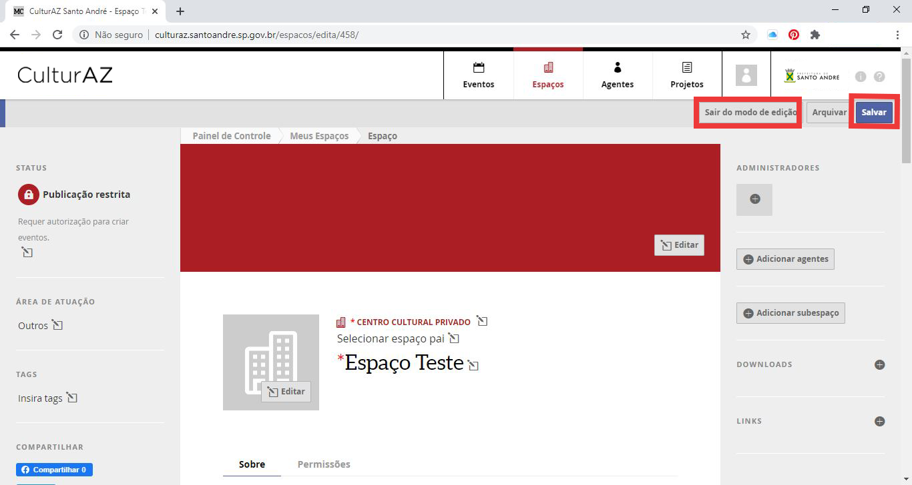

# CRIANDO UM ESPAÇO

1. A criação de um **‘Espaço’** segue os mesmos passos do item anterior. **É necessária a existência prévia de um Agente Individual que será o “responsável” pelo perfil do ‘Espaço’.**
2. Acesse o **‘Painel de Controle’** do seu Agente Individual clicando no campo da sua foto no menu superior.

1. Na tela seguinte, no menu da esquerda, clique em ‘**Meus Espaços’**. Depois, em **‘Adicionar Novo Espaço’**. Obs: você pode utilizar o atalho **‘+’** que aparece ao lado de ‘Espaços’ no ‘Painel de Controle’.

1. Preencha todos os campos: **‘Nome de exibição’**, **‘Descrição curta’**, **‘Acessibilidade’**, **‘Capacidade’**, **‘Horário de funcionamento’**, **‘Site’**, **‘E-mails’** e **‘Telefones’**.
2. Em **‘Selecione um Tipo’**, escolha a descrição que mais se aproxima ao seu espaço cultural.
3. Obervação: o item **‘Selecionar Espaço Pai’** é utilizado apenas quando o espaço que está sendo criado faz parte de outro que já existe no CulturAZ.

1. Abaixo do mapa, insira o **endereço completo** do seu Espaço. O pin do mapa será automaticamente movido para o endereço cadastrado. Caso necessite de ajuste, você pode arrastá-lo manualmente para o endereço exato.
2. Na sequência, você pode inserir uma descrição longa e critérios de uso do seu espaço.

1. No menu da esquerda, em **‘Publicação Restrita’**, você pode escolher entre **‘Publicação restrita – requer autorização para criar eventos’** \(neste caso, terceiros não podem publicar eventos em seu espaço automaticamente e você receberá uma notificação no ‘Painel de Controle’\) e **‘Publicação livre – qualquer pessoa pode criar eventos’** \(neste opção, terceiros podem criar eventos no seu Espaço sem que você receba notificação prévia\).
2. Ainda no menu da esquerda, selecione uma **‘Área de Atuação’** \(pode ser mais de uma\) e insira **‘Tags’** que ajudem a identificar seu Espaço.



**Lembre-se de ‘Salvar Racunho’ frequentemente durante o cadastro e, ao final, clique em ‘Publicar’.**



1. Observe que, no final da página, aparece o item **‘Publicado por’** com o nome de seu Agente Individual que dá acesso a toda a plataforma CulturAZ.

1. Com seu Espaço **já publicado, quando entrar em edição novamente,** aparecerá no menu da direita as opções **‘Administradores’** \(Agentes Individuais que terão poder de editar seu Espaço\) e **‘Adicionar Agentes’** \(Agentes que fazem parte do seu Espaço, mas não podem editá-lo\). Em ambos os casos, é necessário que os Agentes a serem associados ao seu Espaço já possuam conta no CulturAZ.



**Seu Espaço pode ser editado em qualquer momento desde que você esteja logado com seu Agente Individual. Ao editá-lo, lembre-se de ‘Salvar’ e, ao final, clicar em ‘Sair do modo de edição’.**



