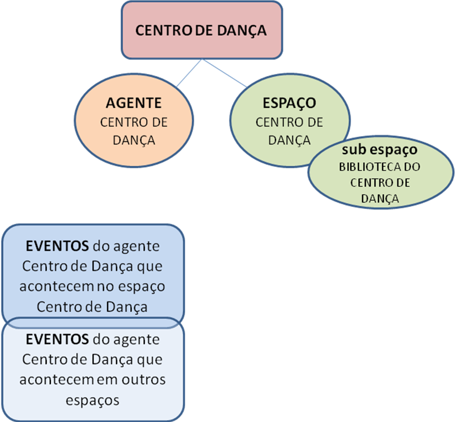

# EXPLORANDO OUTROS RECURSOS DO CULTURAZ

Criados o seu agente individual e o agente coletivo, agora você navegar pelo **‘Menu’** da plataforma Culturaz e inserir outras informações como, por exemplo, uma **‘Eventos’** gerando uma agenda de programação do seu espaço, criar **‘Subespaços’** e **‘Projetos’** importantes.

Observe exemplo do Centro de Dança, que é um projeto de formação cultural da Secretaria de Cultura e ao mesmo tempo é um espaço físico com agenda cultural e biblioteca:

