# CULTURAZ

\*\*\*\*

**TUTORIAL PARA CADASTRO DE AGENTES E ESPAÇOS**

Julho/2020

**A Secretaria de Cultura de Santo André adota a plataforma CulturAZ como canal oficial de cadastro e mapeamento.**

**http://culturaz.santoandre.sp.gov.br/**

CulturAZ é a plataforma livre, gratuita e colaborativa de mapeamento da Secretaria de Cultura de Santo André sobre o cenário cultural andreense. Mais que a facilidade de se programar, o mapeamento permite conhecer a diversidade cultural que a cidade oferece e contribui na elaboração de políticas públicas.

**IMPORTANTE:**

**Para figurar na plataforma, você deve ter uma conta-cadastro inicial como AGENTE INDIVIDUAL \(Pessoa Física = Agente Individual\).**

**Com seu Agente Individual devidamente cadastrado, é possível incluir um AGENTE COLETIVO \(MEI, empresa com CNPJ, coletivos formais ou informais, associações culturais, ONG’s, etc\), bem como EVENTOS, ESPAÇOS e PROJETOS.**

**Dúvidas sobre o cadastro podem ser enviadas para** [**culturaz@santoandre.sp.gov.br**](mailto:culturaz@santoandre.sp.gov.br)**.**

1. Comece a criação de seu Agente Individual \(Pessoa Física - ID da Cultura\) no campo **‘Registrar-se’**.

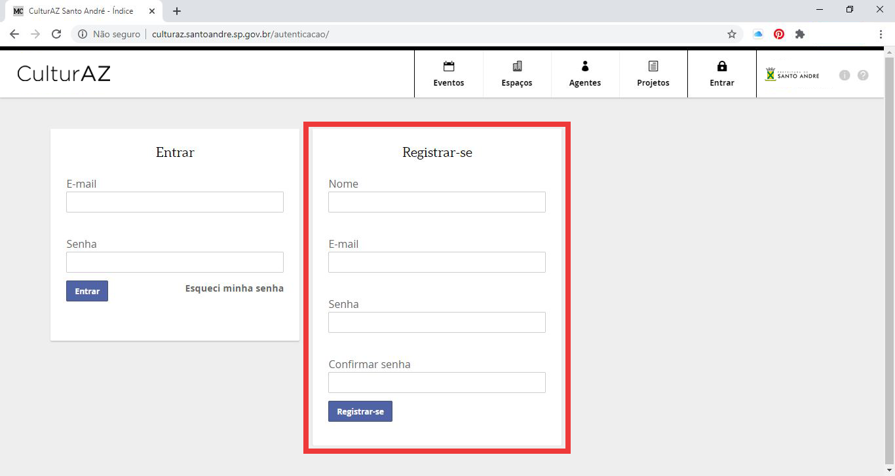

**IMPORTANTE:**

Preste **ATENÇÃO** na hora de colocar e-mail e senha. **ANOTE SEU E-MAIL E SENHA.** A Secretaria de Cultura não consegue recuperar essas informações, somente **VOCÊ**, por meio do processo de redefinição da senha.

1. Na tela seguinte, preencha todos os campos: **‘Nome de exibição’**, **‘Descrição curta’**, **a ficha cadastral completa, INCLUSIVE CPF e E-MAIL PÚBLICO**. Em **‘Selecione um Tipo’**, escolha a opção **‘INDIVIDUAL’**.

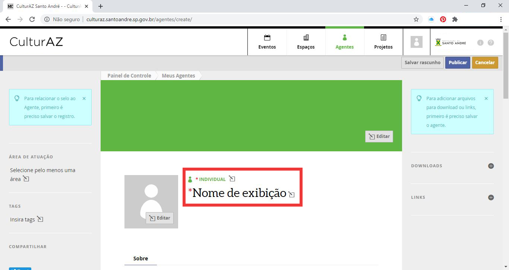

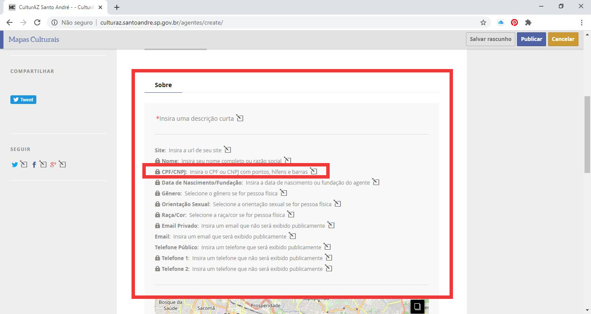

1. Abaixo do mapa, insira seu **endereço completo**. O pin do mapa será automaticamente movido para o endereço cadastrado. Caso necessite de ajuste, você pode arrastá-lo manualmente para o endereço exato.
2. Na sequência, você pode inserir no campo **‘Descrição’** uma descrição longa de suas atividades. **Vídeos e Galeria de fotos não são necessários.**

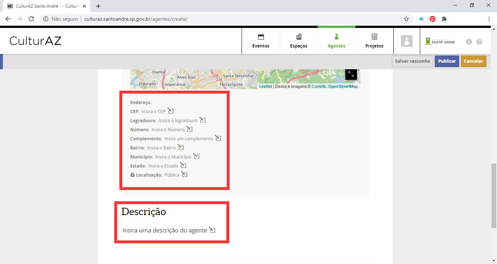

1. No menu da esquerda, selecione uma **‘Área de Atuação’** \(pode ser mais de uma\) e insira **‘Tags’** que ajudem a identificar seu trabalho.

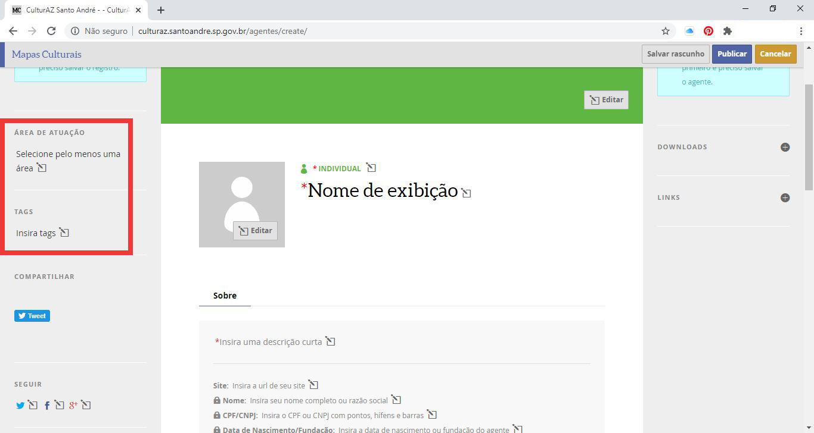

**IMPORTANTE:**

**Lembre-se de ‘Salvar Racunho’ frequentemente e, ao final, clique em ‘Publicar’.**

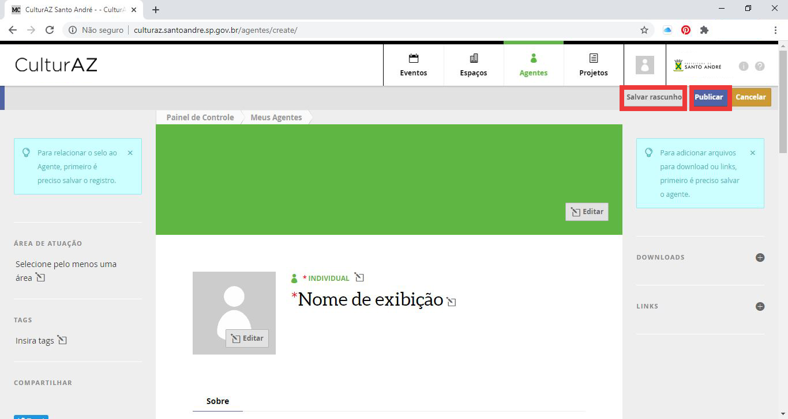

1. Seu Agente Individual pode ser editado em qualquer momento desde que você esteja logado na plataforma. Ao editá-lo, lembre-se de **‘Salvar’** e, ao final, clicar em **‘Sair do modo de edição’.**

**CRIANDO UM AGENTE COLETIVO**

1. Para criar um cadastro para um agente coletivo, **é necessária a existência prévia de um Agente Individual que será o “responsável” pelo perfil Agente Coletivo**.
2. Acesse o **‘Painel de Controle’** do seu Agente Individual clicando no campo da sua foto no menu superior.

1. Na tela seguinte, no menu da esquerda, clique em ‘**Meus Agentes’**. Depois, em **‘Adicionar Novo Agente’**. Obs: você pode utilizar o atalho **‘+’** que aparece ao lado de ‘Agentes’ no ‘Painel de Controle’.

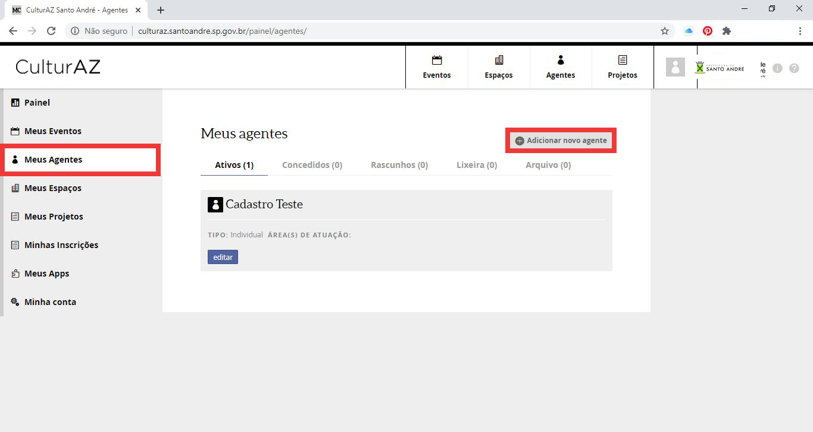

1. A partir desta etapa, siga os mesmos passos da criação de um Agente Individual preenchendo todos os campos. **Não se esqueça do CNPJ.** **Vídeos e Galeria de fotos não são necessários.**

**IMPORTANTE:**

**Você deve alterar o tipo de agente para ‘COLETIVO’. Lembre-se de ‘Salvar Racunho’ frequentemente durante o cadastro e, ao final, clique em ‘Publicar’.**

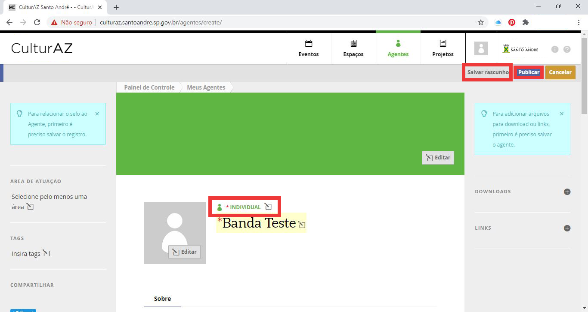

1. Com o novo agente publicado, ao entrar no modo **‘Edição’**, você pode associar outras pessoas ao seu Agente Coletivo em **‘Adicionar Agentes’**. Por exemplo, incluir todos os músicos de uma banda, desde que os mesmos tenham Agente Individual criado no CulturAZ também. Em **‘ADMINISTRADORES’**, você poderá associar agentes que terão permissão para editar seu Agente Coletivo.

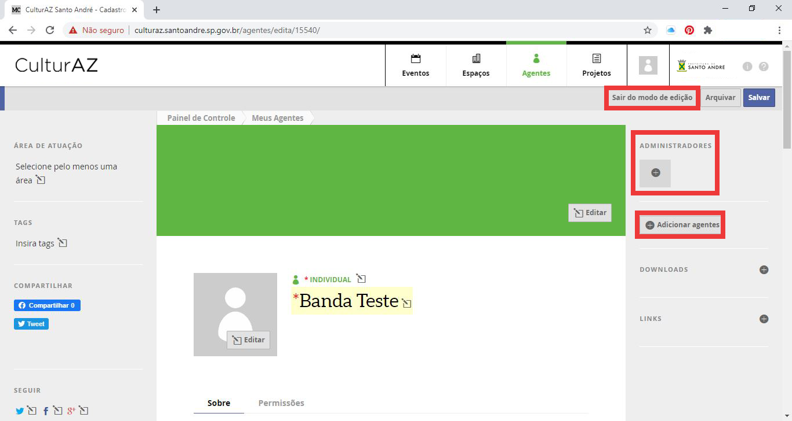

**IMPORTANTE:**

**Seu Agente Coletivo pode ser editado em qualquer momento desde que você esteja logado com seu Agente Individual. Ao editá-lo, lembre-se de ‘Salvar’ e, ao final, clicar em ‘Sair do modo de edição’.**

**OBSERVAÇÃO:**

**Repare que o Agente Coletivo é criado COM O MESMO LOGIN E SENHA DO AGENTE INDIVIDUAL. É possível ter vários agentes com uma única senha.**

**CRIANDO UM ESPAÇO**

1. A criação de um **‘Espaço’** segue os mesmos passos do item anterior. **É necessária a existência prévia de um Agente Individual que será o “responsável” pelo perfil do ‘Espaço’.**
2. Acesse o **‘Painel de Controle’** do seu Agente Individual clicando no campo da sua foto no menu superior.

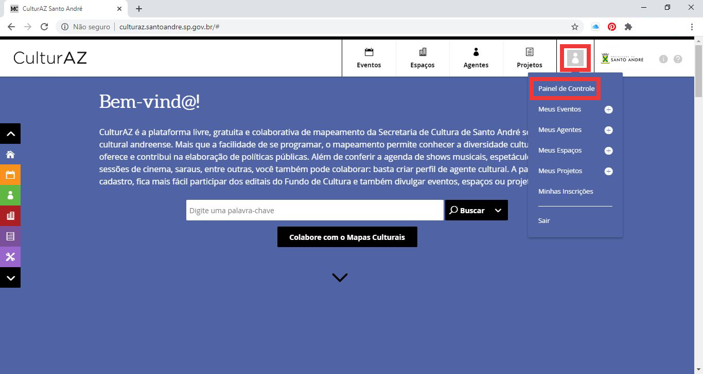

1. Na tela seguinte, no menu da esquerda, clique em ‘**Meus Espaços’**. Depois, em **‘Adicionar Novo Espaço’**. Obs: você pode utilizar o atalho **‘+’** que aparece ao lado de ‘Espaços’ no ‘Painel de Controle’.

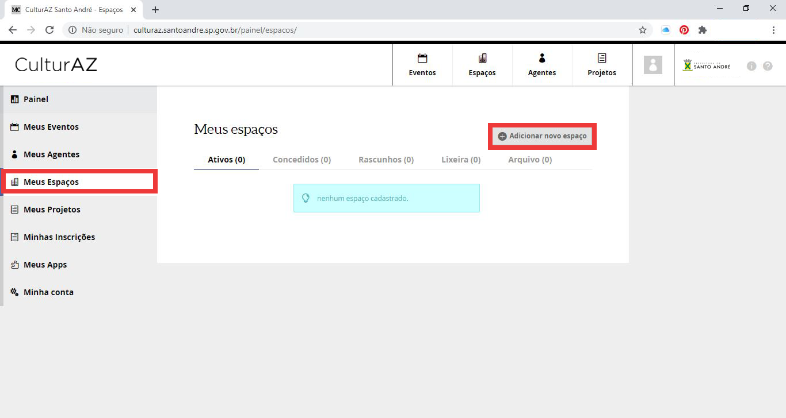

1. Preencha todos os campos: **‘Nome de exibição’**, **‘Descrição curta’**, **‘Acessibilidade’**, **‘Capacidade’**, **‘Horário de funcionamento’**, **‘Site’**, **‘E-mails’** e **‘Telefones’**.
2. Em **‘Selecione um Tipo’**, escolha a descrição que mais se aproxima ao seu espaço cultural.
3. Obervação: o item **‘Selecionar Espaço Pai’** é utilizado apenas quando o espaço que está sendo criado faz parte de outro que já existe no CulturAZ.

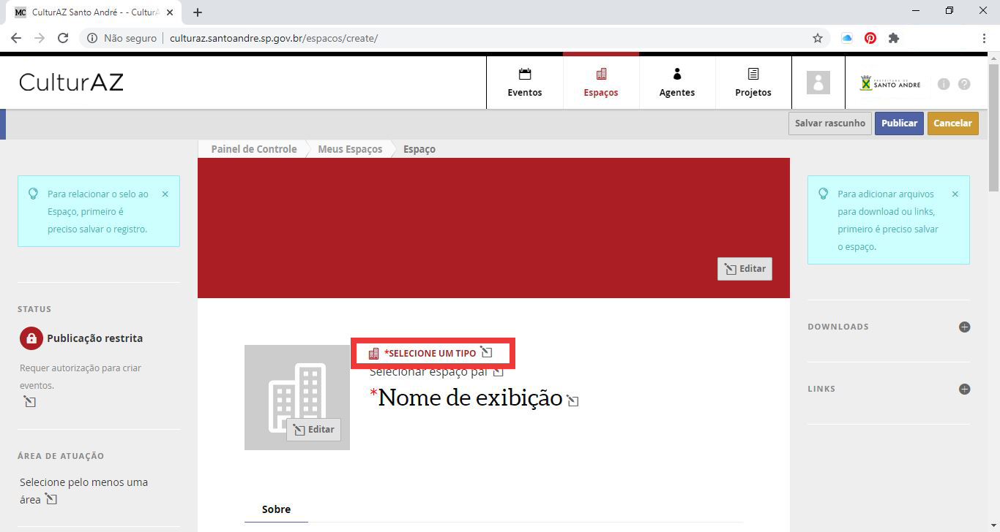

1. Abaixo do mapa, insira o **endereço completo** do seu Espaço. O pin do mapa será automaticamente movido para o endereço cadastrado. Caso necessite de ajuste, você pode arrastá-lo manualmente para o endereço exato.
2. Na sequência, você pode inserir uma descrição longa e critérios de uso do seu espaço.

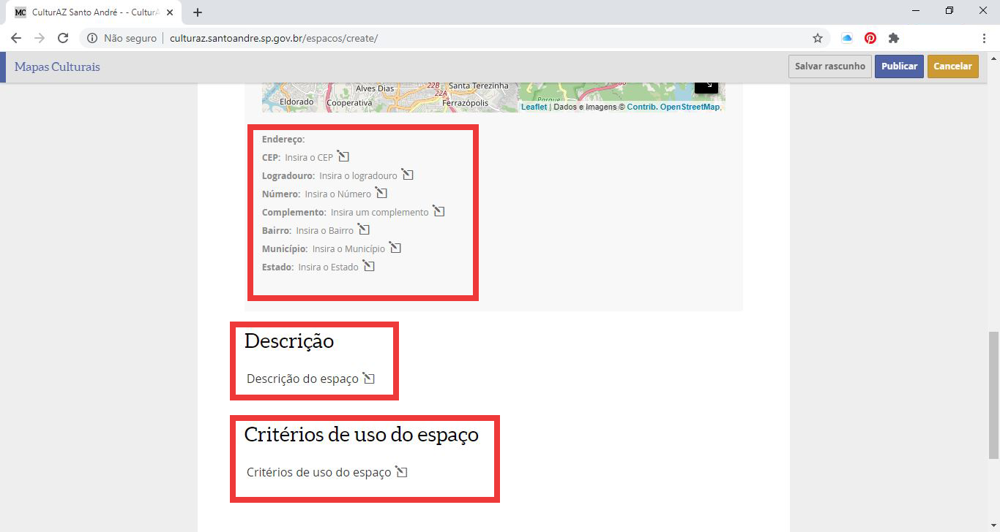

1. No menu da esquerda, em **‘Publicação Restrita’**, você pode escolher entre **‘Publicação restrita – requer autorização para criar eventos’** \(neste caso, terceiros não podem publicar eventos em seu espaço automaticamente e você receberá uma notificação no ‘Painel de Controle’\) e **‘Publicação livre – qualquer pessoa pode criar eventos’** \(neste opção, terceiros podem criar eventos no seu Espaço sem que você receba notificação prévia\).
2. Ainda no menu da esquerda, selecione uma **‘Área de Atuação’** \(pode ser mais de uma\) e insira **‘Tags’** que ajudem a identificar seu Espaço.

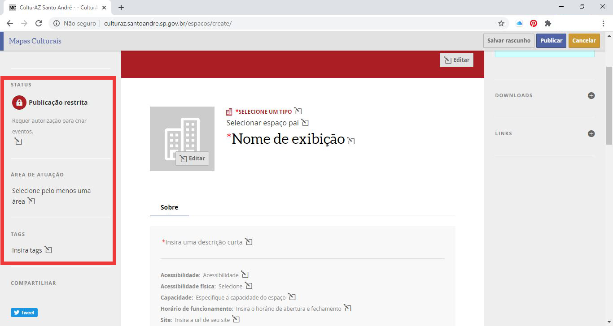

**IMPORTANTE:**

**Lembre-se de ‘Salvar Racunho’ frequentemente durante o cadastro e, ao final, clique em ‘Publicar’.**

1. Observe que, no final da página, aparece o item **‘Publicado por’** com o nome de seu Agente Individual que dá acesso a toda a plataforma CulturAZ.

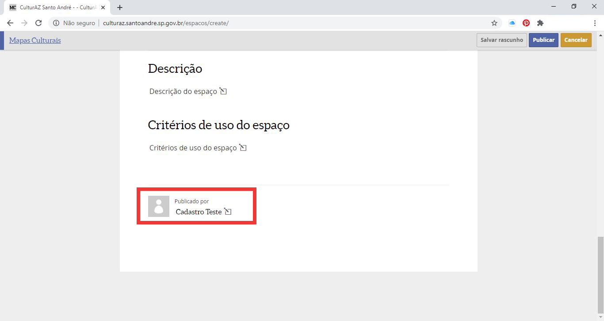

1. Com seu Espaço **já publicado, quando entrar em edição novamente,** aparecerá no menu da direita as opções **‘Administradores’** \(Agentes Individuais que terão poder de editar seu Espaço\) e **‘Adicionar Agentes’** \(Agentes que fazem parte do seu Espaço, mas não podem editá-lo\). Em ambos os casos, é necessário que os Agentes a serem associados ao seu Espaço já possuam conta no CulturAZ.

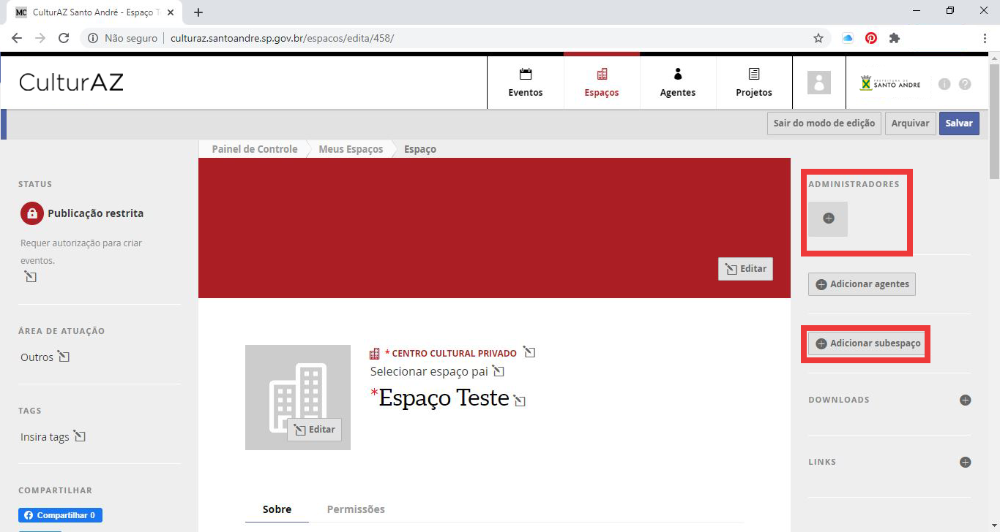

**IMPORTANTE:**

**Seu Espaço pode ser editado em qualquer momento desde que você esteja logado com seu Agente Individual. Ao editá-lo, lembre-se de ‘Salvar’ e, ao final, clicar em ‘Sair do modo de edição’.**

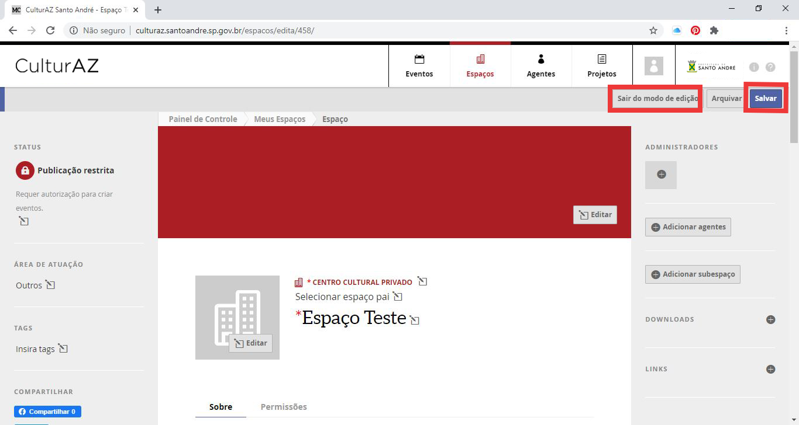

**EXPLORANDO OUTROS RECURSOS DO CULTURAZ**

Criados o seu agente individual e o agente coletivo, agora você navegar pelo **‘Menu’** da plataforma Culturaz e inserir outras informações como, por exemplo, uma **‘Eventos’** gerando uma agenda de programação do seu espaço, criar **‘Subespaços’** e **‘Projetos’** importantes.

Observe exemplo do Centro de Dança, que é um projeto de formação cultural da Secretaria de Cultura e ao mesmo tempo é um espaço físico com agenda cultural e biblioteca:

